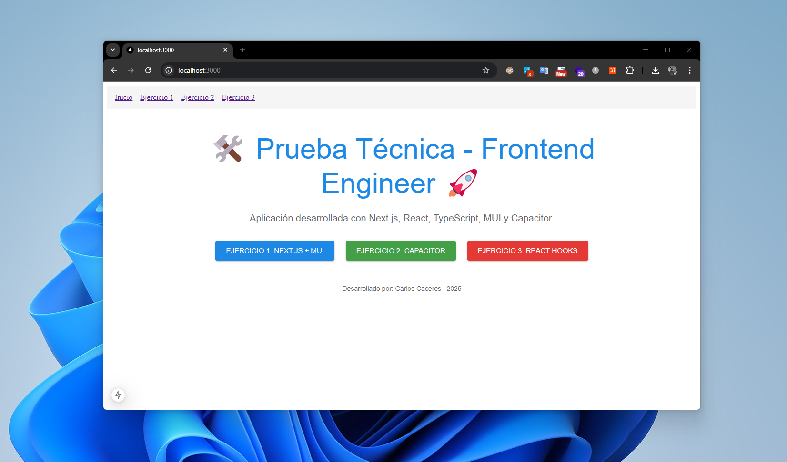
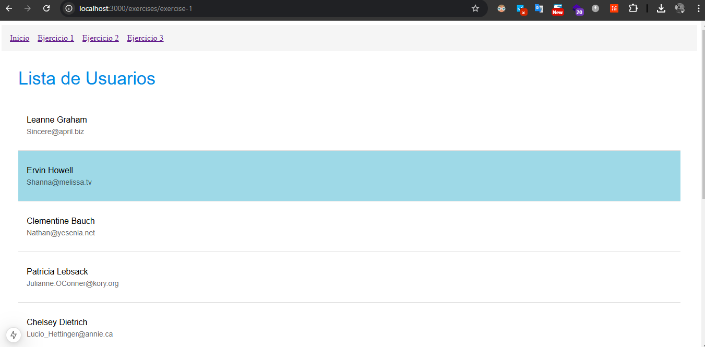
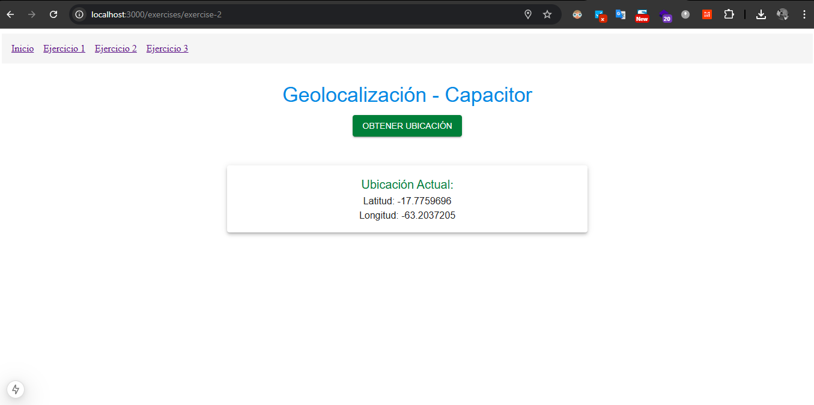
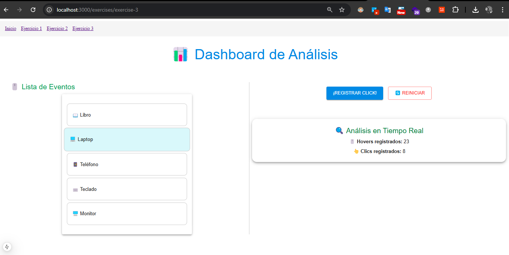

# 🛠️ Práctica - Frontend (React/Next.js/TypeScript)

## 🚀 Descripción

Este proyecto fue desarrollado como parte de práctica de **NextJS**.  
Se implementaron los siguientes ejercicios:

1. **Next.js + React + MUI Basics:**  
   - Uso de `getServerSideProps` para obtener datos desde una API.  
   - Estilizado de la lista con Material UI (MUI).  

2. **Capacitor Plugin Usage:**  
   - Integración del plugin `@capacitor/geolocation`.  
   - Mapa interactivo con `react-leaflet` para visualizar la ubicación actual.  

3. **React Hooks & State Management:**  
   - Implementación de `useReducer` y `Context API`.  
   - Registro dinámico de eventos de hover y clic.

---

## ⚙️ **Tecnologías Utilizadas**

- ⚛️ **React**
- 🚀 **Next.js** (App Router)
- 🛠️ **TypeScript**
- 🎨 **Material UI (MUI)**
- 📡 **Capacitor**
- 🔍 **Axios** para llamadas a APIs

---



---

## 📂 **Estructura del Proyecto**
 ```
test-nextjs-lafuente/
└── src/
    └── app/
        ├── page.tsx               // Página principal (opcional)
        └── exercises/
            ├── exercise-1/             // Ejercicio 1: Next.js + MUI + API
            │   ├── page.tsx            // Página principal del ejercicio 1
            │   ├── UserList.tsx        // Componente reutilizable
            │   ├── theme.ts            // Tema MUI personalizado
            │   └── api.ts              // Llamada a la API
            ├── exercise-2/             // Ejercicio 2: Capacitor
            │   ├── page.tsx            // Página principal del ejercicio 2
            │   └── capacitorService.ts // Lógica Capacitor
            └── exercise-3/             // Ejercicio 3: React Hooks + Context
                ├── page.tsx            // Página principal del ejercicio 3
                ├── AnalyticsContext.tsx// Context para analytics
                └── components/         // Subcarpeta para componentes
        ├── components/
        │   └── CommonButton.tsx        // Componente común reutilizable
        ├── theme/
        │   └── customTheme.ts          // Tema global MUI
        ├── utils/
        │   └── types.ts                // Definiciones de tipos globales
        └── hooks/
            └── useFetch.ts             // Hook personalizado para APIs
 ```

## 🛠️ **Instrucciones para Ejecutar el Proyecto**

1. Clonar el repositorio:

   ```bash
   git clone https://github.com/cacerescarlos/p7-practice-nextjs-with-innovuslabs.git
   cd p7-practice-nextjs-with-innovuslabs
   ```

2. Instalar dependencias:

   ```bash
   npm install
   ```

3. Iniciar el servidor de desarrollo:

   ```bash
   npm run dev
   ```

4. Abrir en el navegador:
   - 🌐 **http://localhost:3000**

---

## 📲 **Configuración de Capacitor**

1. Inicializar Capacitor (si no se ha hecho):

   ```bash
   npx cap init
   ```

2. Agregar plataforma (Android):

   ```bash
   npx cap add android
   ```

3. Sincronizar cambios con Capacitor:
   ```bash
   npx cap sync
   ```

 ## Limpieza y Formateo de Código
🔍 Comando para formatear todo el proyecto con Prettier:

npx prettier --write 

## 🖥️ Ejercicio 1: Next.js + MUI + API

Esta sección muestra el listado de usuarios obtenido desde una API y renderizado con MUI.



---

## 📱 Ejercicio 2: Capacitor - Geolocalización

En este ejercicio se utiliza Capacitor para obtener la ubicación actual y mostrarla en un mapa.



---

## ⚛️ Ejercicio 3: React Hooks & State Management

Aquí se muestra el manejo de estado compartido con `Context API` y `useReducer`.


